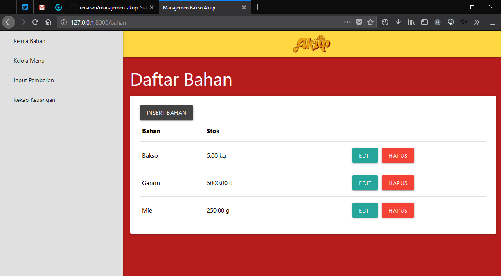
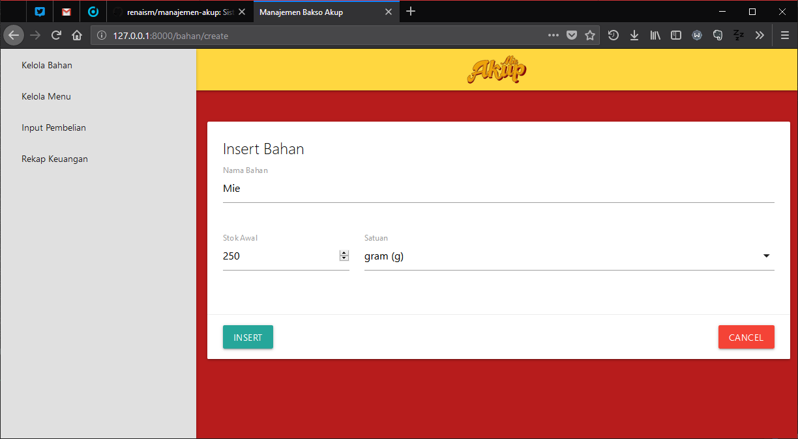

# Manajemen Akup
Sistem manajemen Rumah Makan Bakso Akup cabang Banjaran. Aplikasi ini menggunakan framework [Laravel](https://laravel.com/). Manajemen Akup merupakan tugas besar dari mata kuliah APPL dan IMPAL. **Sangat disarankan untuk membaca SKPL dan DPPL terlebih dahulu untuk dapat memahami fungsi dari aplikasi ini**. SKPL dan DPPL bisa didapatkan [di sini](https://drive.google.com/drive/folders/1xzuX0f45B-VJ0At7I0y6f2OIdEBuHvpO?usp=sharing).

*Salam profit dari ketua kami, Bayu Arifat Firdaus.*

# Progress Mingguan
## Cyclomatic Complexity
Laporan: https://docs.google.com/document/d/1iJhwsOc5Xt81xI1PcCz37eL9Ysw4gXoX84zqegTLGI0/edit?usp=sharing

## 1. Screenshot Aplikasi
<table>
<tr>
<td></td>
<td></td>
</tr>
<tr>
<td><small>Kelola Bahan</small></td>
<td><small>Insert Bahan</small></td>
</tr>
</table>

## 2. Validasi Data
### 1. Existence Check
Existence check kebanyakan sudah dilakukan secara otomatis oleh fitur Eloquent dari *framework* Laravel. Hal ini khususnya berlaku di bagian `Insert Bahan` di atas.

### 2. Data-type Check
Pada saat akan memasukkan data bahan ke *database*, di *controller* akan dicek jika *input* dari *user* merupakan tipe data yang bersesuaian. Berikut cuplikan kode untuk memastikan stok yang dimasukkan berupa angka:
```php
$this->validate($request, [
    'nama' => 'required',
    'satuan' => 'required',
    'stok' => 'required|numeric'
]);
```
Link ke *source code* => [`BahanController.php`](app/Http/Controllers/BahanController.php)

### 3. Domain Check
Untuk bagian `Insert Bahan` tidak menggunakan domain check

### 4. Combination Check
Untuk bagian `Insert Bahan` tidak menggunakan combination check

### 5. Self-checking digit
Untuk bagian `Insert Bahan` tidak menggunakan self-checking digit

### 6. Format check
Untuk bagian `Insert Bahan` tidak menggunakan format check

## 3. Penerapan MVC di Laravel
* Model dari aplikasi ada di folder [`app`](app/) (Contoh: [`Bahan.php`](app/Bahan.php))
* View dari aplikasi ada di foler [`resources/views`](resources/views/) (Contoh: [`create.blade.php`](resources/views/bahan/create.blade.php))
* Controller dari aplikasi ada di folder [`app/Http/Controllers`](app/Http/Controllers/) (Contoh: [`BahanController.php`](app/Http/Controllers/BahanController.php))

# Project Setup

Di sini gua bakal ngejelasin gimana caranya temen-temen ngejalanin *project* ini di komputer/laptop masing-masing. Oke, pertama temen-temen install dulu semua aplikasi ini secara berurutan:
1. [Git](https://git-scm.com/downloads)
2. [XAMPP](https://www.apachefriends.org/)
3. [Composer](https://getcomposer.org/download/) (Pilih yang Windows Installer)

Untuk lebih jelasnya, video tutorial *step by step* instalasinya akan dibuat oleh *YouTuber* kebanggan qta (sekaligus *leader* juga) yaitu [Bayu Arifat](https://www.youtube.com/channel/UC71TKqN-dRYpudR2Iv4tuCA/). Pantengin aja terus channelnya hehe jangan lupa subscribe dan klik belnya.

## A. Clone Repository
1. Buka suatu folder di File Explorer (misal: D:\GitHub)
2. Klik kanan, pilih Git Bash Here
3. Di terminal masukin *command* ini (kalo mau copas harus klik kanan->Paste):
```
$ git clone https://github.com/renaism/manajemen-akup.git
```
4. Tunggu aja sampe selesai

## B. Setup Database MySQL
1. Buka XAMPP
2. Jalanin Apache sama MySQL
3. Buka http://localhost/phpmyadmin/ di browser
4. Di bagian atas, klik tab Databases
5. Create database dengan nama "manajemen-akup"

## C. Setup Laravel dan Dependency
1. Masih di terminal yang sama dari step A, `cd` ke folder yang baru dibuat:
```
$ cd manajemen-akup
```
2. Setup laravel dengan masukin *command* ini satu-satu perbaris:
```
$ composer install
$ cp .env.example .env
$ php artisan key:generate
$ php artisan migrate
``` 
3. Jalanin *development server* laravel:
```
$ php artisan serve
```
4. Coba test buka http://127.0.0.1:8000/ di browser
5. ???
6. *Profit!!!*

## D. Panduan Git
Capek ah udahan dulu. Udah pada jago juga ini.
